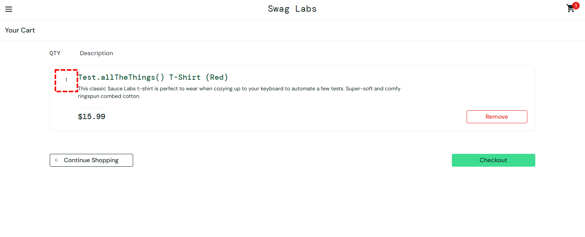
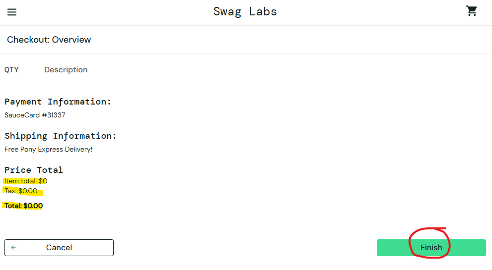

## Setting an item's quantity - Cart Page

**Severity:**  Medium 

**User(s) affected:** all users

**Environment:** Chrome, Windows

### Steps to Reproduce
| Step                                              | Resulting screen                              |
| ------------------------------------------------- | --------------------------------------------- |
| 1. Log in to the website                          | Store page is displayed                       |
| 2. Click on the 'Add to cart' button for any item | Store page is displayed. Cart icon has a `1`  |
| 3. Click on the cart link on the top right corner | Cart page is displayed                        |
| 4. Click on the square at the top left corner of the item container, which holds a value of 1 | Nothing happens |

### Expected Result
The web element gains focus as a text input and the user should be able to modify its value.

### Actual Result
The web element is actually just a div and is not interactable with.

### Evidence

### Notes
In case this is intentional, it just limits the users wants, or mandates them to do several orders of the same item. 
___
___
## Checking out without adding a single item
**Severity:**  High 

**User(s) affected:** all users

**Environment:** Chrome, Windows

### Steps to Reproduce
| Step                                              | Resulting screen                                                |
| ------------------------------------------------- | --------------------------------------------------------------- |
| 1. Log in to the website                          | Store page is displayed                                         |
| 2. Click on the cart link on the top right corner | Cart page is displayed                                          |
| 3. Click on the green checkout button             | Checkout (step one) page is displayed                           |
| 4. Click on the green continue button             | Checkout (step two) page is displayed                           |
| 5. Click on the green finish button               | Checkout complete page and a success message is displayed       |

### Expected Result
At some point of the checkout flow, the user should be stopped and notified that their cart is empty and that trying to buy is nonsense

### Actual Result
All users are able to get a success message for buying no items

### Evidence

### Notes
Despite normal users not encountering this issue, this is a potential security risk, as a malicious actor could automate repeated requests to generate thousands of empty orders, flooding the database with junk records